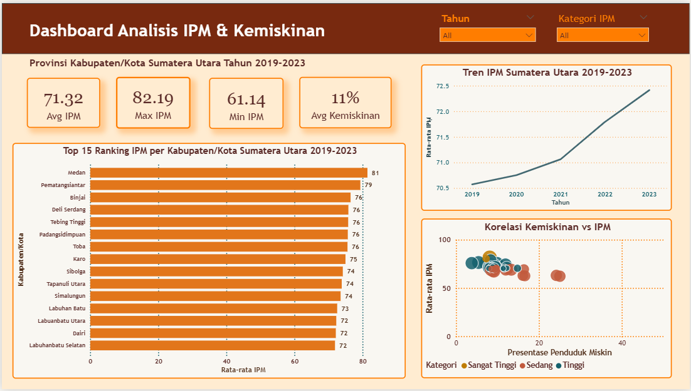

# 📊 Analisis Kemiskinan & IPM Kabupaten/Kota Sumatera Utara


## 📌 Latar Belakang 
Sumatera Utara memiliki 33 kabupaten/kota dengan kondisi pembangunan manusia yang sangat beragam. Kesenjangan antara kawasan perkotaan seperti Medan dengan kabupaten pedalaman masih menjadi tantangan besar. Proyek ini bertujuan menganalisis data Indeks Pembangunan Manusia (IPM) dan kemiskinan untuk mengidentifikasi pola, kesenjangan, dan kabupaten yang memerlukan perhatian prioritas.

---

## ❓ Pertanyaan Analisis

1. Kabupaten/kota mana yang memiliki IPM tertinggi dan terendah di Sumatera Utara?
2. Apakah terdapat korelasi antara tingkat kemiskinan dan nilai IPM?
3. Bagaimana tren IPM Sumatera Utara dalam 5 tahun terakhir?
4. Kabupaten mana yang paling membutuhkan intervensi prioritas berdasarkan data?

---
## 📁 Struktur Proyek

```
ipm-kemiskinan-sumut/
│
├── README.md
├── data/
│   └── ipm_kemiskinan_sumut.xlsx     # Data mentah dari BPS, sudah dibersihkan
├── dashboard/
│   └── ipm_sumut.pbix                # File Power BI Dashboard
└── assets/
    └── screenshot_dashboard.png      # Preview dashboard
```

---

## 📂 Sumber Data

| Indikator | Sumber | Tahun |
|---|---|---|
| Indeks Pembangunan Manusia (IPM) | BPS Sumatera Utara | 2019–2023 |
| Persentase Penduduk Miskin | BPS Sumatera Utara | 2019–2023 |
| Rata-rata Lama Sekolah | BPS Sumatera Utara | 2019–2023 |
| Pengeluaran Per Kapita | BPS Sumatera Utara | 2019–2023 |

> Semua data bersumber dari [BPS Sumatera Utara](https://sumut.bps.go.id) dan tersedia untuk publik.

---

## 🛠️ Tools yang Digunakan

- **Microsoft Excel** — pembersihan dan transformasi data awal
- **Power BI Desktop** — pembuatan dashboard interaktif dan visualisasi
- **Power Query** — transformasi dan validasi data
- **DAX** — kalkulasi kolom dan measure (kategori IPM, rata-rata, dll.)

---

## 📊 Dashboard Preview



### Visualisasi yang ada di dashboard:
- **Bar Chart** — Ranking IPM 33 kabupaten/kota (tertinggi ke terendah)
- **Line Chart** — Tren IPM Sumatera Utara vs rata-rata nasional (2019–2023)
- **Scatter Plot** — Korelasi antara kemiskinan (%) dan nilai IPM
- **KPI Cards** — Rata-rata IPM, jumlah kabupaten kategori rendah, gap tertinggi-terendah
- **Slicer** — Filter interaktif berdasarkan tahun dan kabupaten

---

## 💡 Key Insights

Analisis menunjukkan kesenjangan IPM mencapai ±20 poin antara kabupaten tertinggi dan terendah di Sumatera Utara, dengan kota-kota besar mendominasi ranking teratas. Ditemukan korelasi negatif yang jelas antara tingkat kemiskinan dan IPM — kabupaten dengan kemiskinan di atas 20% rata-rata memiliki IPM di bawah 70. Kota Medan memiliki IPM tertinggi (81) sementara Nias Selatan terendah (64.12). Meski demikian, tren 5 tahun terakhir menunjukkan perbaikan IPM provinsi secara konsisten, naik dari 70.5 ke 72.5.

---

## 🚀 Cara Membuka Dashboard

1. Download [Power BI Desktop](https://powerbi.microsoft.com/desktop) (gratis)
2. Clone atau download repo ini
3. Buka file `dashboard/ipm_sumut.pbix` di Power BI Desktop
4. Dashboard siap digunakan secara interaktif

```bash
git clone https://github.com/jihanlatifah/ipm-kemiskinan-sumut.git
```

---

## 👩‍💻 Tentang Proyek Ini

Proyek ini dibuat sebagai bagian dari pengembangan portofolio Data Analyst. Analisis dilakukan secara independen menggunakan data publik dari BPS untuk mengasah kemampuan dalam pengolahan data, visualisasi, dan penarikan insight berbasis data.

**Dibuat oleh:** Jihan Latifah  
**LinkedIn:** [linkedin.com/in/jihan-latifah](https://www.linkedin.com/in/jihan-latifah)  
**Email:** jihanlatifah890@gmail.com

---

*⭐ Jika proyek ini bermanfaat, jangan lupa beri bintang pada repo ini!*
